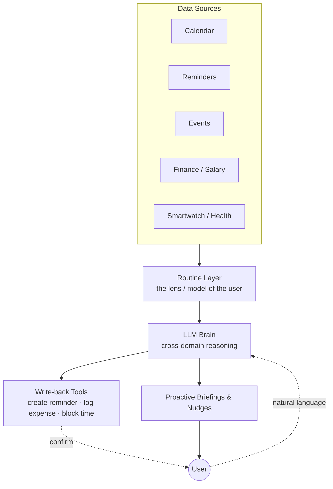

# Personal Daily Assistant — Product Concept & Build Specification

**Working name:** _TBD_ (candidates: **Cadence**, **Daylo**, **Routine**)
**Type:** Online, context-aware personal life assistant (health · finance · scheduling)
**Status:** Concept locked, ready for build planning
**Platform assumption:** Android-first, cross-platform later (see §10)

---

## 1. One-line pitch

A personal chief-of-staff that connects to your calendar, reminders, events, finances, and wearable, reads them *through the lens of your daily routine*, and proactively tells you what matters today — and adjusts your day when you want to add something new.

---

## 2. Thesis

This category doesn't win on features. It wins on **trust + habit**.

- It's a **daily-routine** app → low churn (people open it every day).
- The value is **synthesis across silos**, not logging. A calendar alone is dumb; a calendar that knows payday is Friday, the bill is due Saturday, and there's a doctor's appointment Thursday — and says so as one coherent brief — is an assistant.
- **No ads.** The pitch is "you pay us instead of being sold." Ads in a money-and-meds app would torch the exact trust that justifies a subscription.

**Identity — explicitly *not* Siri.** Siri is reactive ("set a timer"). This is **proactive and cross-domain**: _"Heads up — you get paid Friday but the electric bill is due Saturday. Want a Thursday nudge?"_

---

## 3. The core mental model

> **Free = it remembers and reminds. Paid = it thinks and adjusts.**

Free is a smart organizer. Paid is the actual assistant. Every paid feature is either LLM-reasoning (costs money per user, so it must be paid) or data continuity (backup/sync).

---

## 4. Architecture

Three layers:

1. **Context graph** — calendar + reminders + events + finance + health, unified in one model.
2. **Routine layer** — the *lens*. The recurring rhythm of the user's day, against which all data is interpreted and timed.
3. **LLM brain + write-back tools** — reasons over the context graph through the routine lens, then *acts* (create reminder, log expense, block calendar time) — always with user confirmation for anything it changes.

**Why routine is central:** calendar, finance, reminders, and events are *data sources*. Routine is the *model of you* that makes everything else well-timed and personal. It is the lens, not a sixth tile.

---

## 5. Connectors / data sources

### 5.1 Calendar, Reminders, Events — easy
Clean APIs available: Google Calendar API, Apple Calendar (CalDAV / EventKit), Google Tasks. Read access drives the briefing; write access powers the optimizer and reminder creation.

### 5.2 Finance / Salary — the hard part ⚠️
There is **no clean consumer open-banking API** in the Philippines for GCash / Maya / banks. "Connect to your finances" is a marketing line that engineering has to *earn*. Practical paths:

- **Manual salary + recurring entry** (always available, the safe baseline).
- **Transaction SMS / notification parsing** — how many PH fintech apps actually capture spending.

> **Hard gate:** Google Play heavily restricts SMS-reading permissions — an app generally must be the default SMS handler or obtain a specific use-case exception. Plus the **Data Privacy Act** applies strictly to financial data. **Verify current Play policy before committing the architecture to SMS parsing.**

### 5.3 Smartwatch / Health — optional module
Integration surface: **HealthKit** (iOS) and **Health Connect** (Android). Module is gated on whether wearable data is actually present.

> Health data is the **most restricted** category on both platforms and under the DPA: cannot be used for ads, must be explicitly disclosed, requires granular consent. Verify current platform health-data policies before build.

### 5.4 Routine — see §7

---

## 6. Core capabilities

| Capability | What it does |
|---|---|
| **Daily briefing** | Speaks at routine-anchored moments — morning brief, midday check, evening wind-down. Not one flat dump. |
| **Routine-timed reminders** | Meds, bills, tasks fired at the *right moment* in the user's real day. |
| **Proactive cross-domain nudges** | "Payday Friday vs. bill Saturday." The synthesis that makes it feel alive. |
| **Routine optimizer** | "Analyze my day and make room for a new routine." See §6.1. |
| **Finance tips** | Spending-pattern coaching. General/informational only (see guardrail). |
| **Health tips** | Wearable-based, gentle, non-medical (see guardrail). |
| **Caregiver / family mode** | A caregiver receives a parent's med alerts and bill due dates. The headline differentiator. |

### 6.1 Routine optimizer ("insert a new routine")
The most assistant-like feature. Inputs: current routine anchors + fixed calendar commitments + the new routine and its constraints ("30-min workout, mornings, 4×/week"). The LLM proposes a reshaped day with reasoning — _"mornings are tight from your commute, so I'd move your evening scroll block and slot it at 6:30."_

> **Design rule — it proposes, you confirm.** It never silently rewrites the day. Suggest-and-accept keeps it from being confidently wrong about someone's life, and makes it feel respectful rather than bossy.

### 6.2 Tips — guardrails
- **Health:** gentle, non-medical, no hard numeric targets, no guilt or streak-shaming mechanics. A kind nudge, never a scold. **This tone *is* the safety design.**
- **Finance:** framed as general, informational guidance — not personalized advice from a licensed advisor. Stays clear of regulatory trouble.

---

## 7. The routine layer

Routine is the recurring rhythm — wake, meds at 8, work blocks, meals, gym, wind-down, sleep. It does three jobs no other module can:

1. **Scheduling substrate** — new reminders/tasks slot into real free space ("after lunch, before your 2pm block"), not arbitrary times. This is the "intuitive" feeling.
2. **Timing engine for proactivity** — anchors *when* the assistant speaks (8am brief lands because it knows your 8).
3. **Deviation radar (gently)** — cross routine with each domain: "you've hit your weekend spend pattern early," "short sleep three nights running." Kind, not nagging.

**Build approach — seed it, then learn it.**
- v1: user defines a few anchor times (*fixed* routine).
- Over time: adapt to when the user actually acts (*adaptive* routine). Light heuristics first, not heavy ML — you don't need a model to notice someone logs lunch at 12:30, not 11.

---

## 8. Free vs Paid

### Free — the smart organizer
- Connect calendar, reminders, events (read)
- Manual finance entry + basic monthly budget
- Define a **fixed** daily routine (seeded, doesn't learn)
- Routine-timed reminders + basic "today" briefing
- Local notifications
- Small daily quota of natural-language quick-adds (cap protects API cost)
- **Caps:** ~5 bills · ~3 meds · a few budget categories

### Paid (Pro) — the actual assistant
- Unlimited bills, meds, accounts, categories
- Conversational AI: unlimited natural language + proactive cross-domain reasoning
- **Adaptive routine** (learns your real rhythm)
- **Routine optimizer** (analyze → reshape → insert new habit, propose-and-confirm)
- **Cross-domain insights & forecasts** (overspend prediction, med refill warnings, payday-vs-bill heads-ups)
- **Finance tips** and **health tips via smartwatch**
- Cloud backup, cross-device sync, export (PDF / CSV)
- **Caregiver / family mode**
- Widgets, themes

**The three things people actually pay for:** the optimizer, the tips, and the adaptive routine. That's where it stops being a list and starts looking out for you.

---

## 9. Monetization & pricing

- **Model:** freemium subscription engine + one-time **Lifetime** SKU (captures the large PH segment that refuses recurring charges).
- **No ads** — protects the trust that justifies paying.
- **Economics:** local-ish storage = high margin, but online + LLM = real per-user cost. Reasoning-heavy features *must* be paid or the unit economics break.

**PH pricing anchors** (starting points to validate, not gospel):

| SKU | Price | Note |
|---|---|---|
| Free | ₱0 | Drives habit + word of mouth |
| Pro monthly | ~₱99/mo | Anchor — makes annual look obvious |
| Pro annual | ~₱599/yr | Sell as "₱50/mo" — the push |
| Lifetime | ~₱1,299 | One-time unlock for sub-haters |

**Honest caveat:** solo, this is a volume game — modest ARPU. It lives or dies on low-churn daily habit, the caregiver angle, and the privacy positioning that lifts it above "another budgeting app."

---

## 10. Platform recommendation

**Android-first** — the PH market is Android-heavy, and Health Connect + (verified) SMS-parsing paths live there. Build cross-platform (Flutter or React Native) so iOS follows without a rewrite. Confirm before locking the stack.

---

## 11. Suggested build phases

1. **Phase 1 — Organizer core (free tier).** Local data model, calendar/reminders/events read, manual finance, fixed routine, routine-timed notifications, basic briefing.
2. **Phase 2 — The brain (paid tier).** LLM integration, conversational quick-add, proactive cross-domain briefing, adaptive routine.
3. **Phase 3 — The optimizer + tips.** Routine optimizer (propose-and-confirm), finance tips, forecasts.
4. **Phase 4 — Health + caregiver.** HealthKit / Health Connect integration, health tips, caregiver/family mode.
5. **Phase 5 — Continuity & polish.** Cloud backup, cross-device sync, export, widgets, themes.

---

## 12. Key risks & constraints

| Risk | Note |
|---|---|
| **Play SMS permissions** | Hard gate for finance auto-capture. Verify current policy; have manual entry as fallback. |
| **Health data rules** | Strictest platform + DPA category. Explicit consent, no ad use, full disclosure. |
| **Data Privacy Act (PH)** | Applies across finance, health, routine — all sensitive. Bake consent + encryption in from day one. |
| **LLM cost per user** | Every active paid user costs API spend. Quota the free tier; price Pro to cover it. |
| **Optimizer overreach** | Never auto-rewrite the day. Human-in-the-loop, always. |
| **Tone drift** | Health/finance tips must stay supportive and non-prescriptive, never punitive. |

---

## 13. Suggested tech stack (starting point)

- **App:** Flutter (Android-first, iOS-ready)
- **Local store:** SQLite (Drift / Isar)
- **LLM brain:** cloud model via API, with the user's context graph as input context + tool-calling for write-back
- **Connectors:** Google Calendar API, Google Tasks, EventKit/CalDAV, Health Connect / HealthKit
- **Backend (Pro only):** lightweight sync/backup service + LLM proxy (keeps keys server-side, meters usage)

---

## 14. Open decisions

- [ ] **Confirm platform** (Android-first assumed)
- [ ] **Conversational depth of v1** — quick-add one-liner vs. full chat
- [ ] **Finance capture method** — manual only at launch, or pursue SMS parsing (pending Play policy check)
- [ ] **Product name + brand direction**
- [ ] **Pricing validation** against current PH comparables
